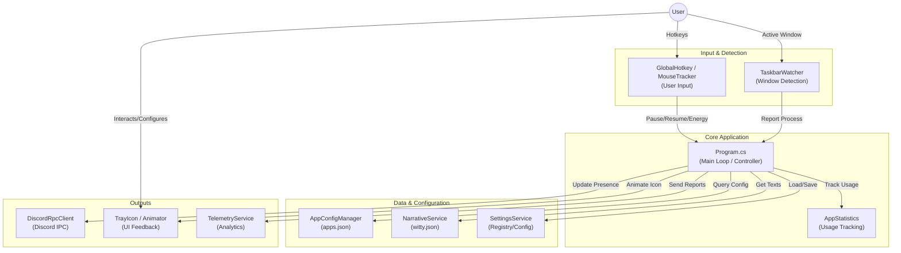

# geetRPCS Architecture Overview

This document describes the high-level architecture of **geetRPCS** (Discord Rich Presence Custom Switcher). Its purpose is to help developers understand how the application works, how data flows, and how its main components interact.

## High-Level Architecture

geetRPCS operates as a **System Tray** application running in the background. The core of the application is the main loop in `Program.cs`, which orchestrates application detection, state management, and communication with Discord RPC.



## Key Components

### 1. Core Controller (`Program.cs`)

This file is the "brain" of the application. Unlike modern .NET applications that might use complex Dependency Injection containers, geetRPCS is designed to be _straightforward_, with `Program.cs` acting as the central controller.

- **Responsibilities:**
  - Initializing all services (`DiscordRPC`, `TaskbarWatcher`, etc.).
  - Handling the _Single Instance Mutex_.
  - Managing global _State_ (`currentApp`, `isPaused`, `privateMode`).
  - Handling events from the Tray Icon and Hotkeys.
  - Updating Discord RPC based on input from `TaskbarWatcher`.

### 2. Services

These services handle specific logic to keep `Program.cs` clean (although currently, `Program.cs` still performs heavy orchestration).

| Service                    | Description                                                                                                                               |
| :------------------------- | :---------------------------------------------------------------------------------------------------------------------------------------- |
| **`TaskbarWatcher`**       | Monitors active window changes and taskbar events using UI Automation / WinAPI hooks. Notifies `Program.cs` when the application changes. |
| **`AppConfigManager`**     | Loads and manages the database of supported applications from `apps.json`.                                                                |
| **`NarrativeService`**     | ("Witty Service") Handles the rotation of funny/unique status texts from `witty.json` so the status doesn't become monotonous.            |
| **`TelemetryService`**     | Sends anonymous usage data (detected applications, duration) for development analysis.                                                    |
| **`UpdateChecker`**        | Checks for application updates and database updates (`apps.json`/`witty.json`) from GitHub.                                               |
| **`MouseActivityTracker`** | (Experimental) Calculates mouse movement "energy" for dynamic status features.                                                            |

### 3. Data Persistence

- **`config.json`**: Basic RPC configuration (default Client ID) and default text when idle.
- **`apps.json`**: Large database mapping Process Name -> Discord App ID & Assets. This file is updated frequently.
- **`witty.json`**: Collection of random sentences for Discord status.
- **`Registry / UserSettings`**: Stored via `SettingsService` for user preferences (such as `AutoStart`, `TrayAnimation`).
- **`AppStatistics`**: Stores local usage data (how long the user uses app X) for the "Today's Stats" feature.

### 4. User Interface (UI)

Since it is System Tray-based, the UI is minimalist:

- **`ContextMenu`**: Right-click menu on the tray icon (Pause, Manage Apps, etc.).
- **`PresencePreviewForm`**: Form to view real-time preview of the Rich Presence display.
- **`ManageAppsForm`**: Interface to disable detection of specific applications.

## Data Flow

1. **Detection**: `TaskbarWatcher` detects the user switching windows to "Visual Studio Code".
2. **Lookup**: `Program.cs` receives the process name (`Code.exe`), then asks `AppConfigManager`: "Is `Code.exe` in the database?"
3. **Assembly**:
   - If yes, retrieve custom App ID (if available) and image assets.
   - Retrieve status text from `NarrativeService` (if Witty mode is active).
   - Format the string (replace `{filename}`, `{project}`) using helpers in `Placeholders`.
4. **Execution**:
   - If the App ID changes, `DiscordRpcClient` is restarted with the new ID.
   - Call `rpc.SetPresence()` with the assembled data.
   - Trigger tray animation via `TrayIconAnimator`.

## Source Folder Structure

```text
geetRPCS/
├── Program.cs           # Main Entry Point
├── Models/              # Data Structures (json mapping objects)
├── Services/            # Logic Providers (Network, File I/O, System Hooks)
├── UI/                  # Windows Forms (Preview, Settings)
├── Utils/               # Helpers (GlobalHotkeys, MemoryHelper)
├── Languages/           # Localization Files (.json)
└── assets/              # Icons and Images
```
